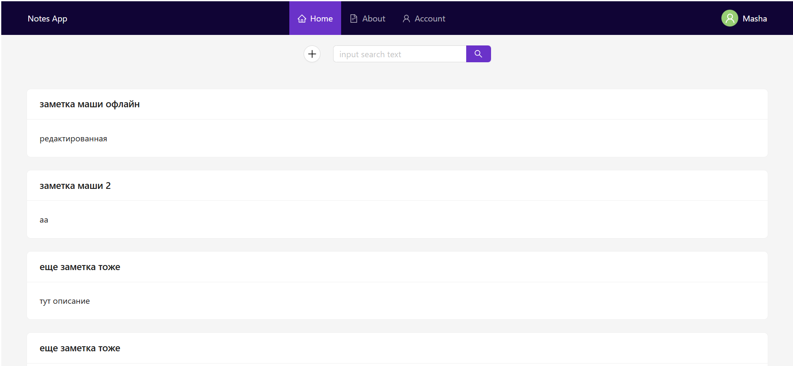
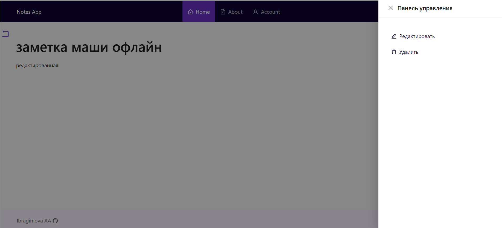
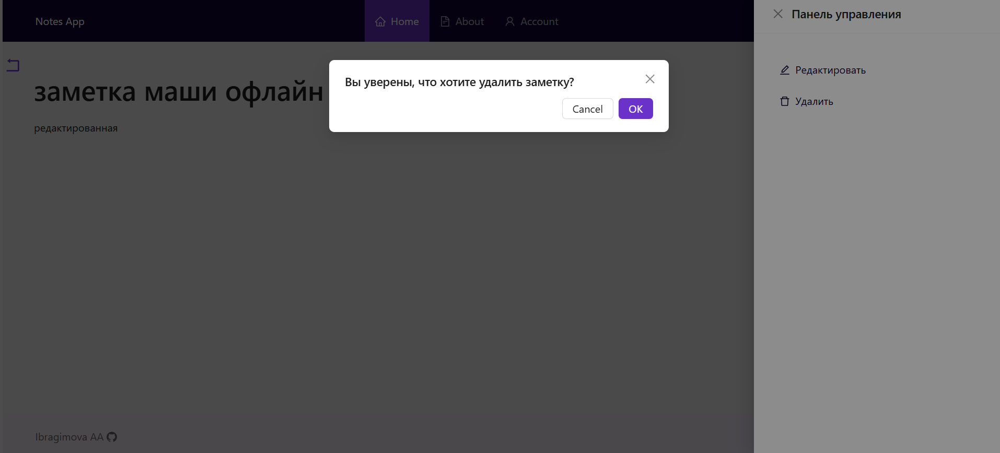

# Notes App (PWA)

## Описание проекта

Прогрессивное веб-приложение для управления заметками с офлайн-режимом и синхронизацией данных. Позволяет создавать, редактировать и удалять заметки даже без интернет-соединения с последующей автоматической синхронизацией при восстановлении связи.

## Ключевые особенности

- Полноценное PWA (установка на устройство, офлайн-работа)
- Двусторонняя синхронизация между IndexedDB и MongoDB
- Система отложенных запросов для офлайн-операций
- Авторизация пользователей
- Адаптивный интерфейс

## Технологический стек

### Frontend

- **React** (функциональные компоненты + хуки)
- **Ant Design** (UI компоненты)
- **React Router** (навигация)
- **IndexedDB** (офлайн-хранилище)
- **Axios** (HTTP-запросы)

### Backend

- **Node.js** + **Express**
- **MongoDB** (основное хранилище)
- **JWT** аутентификация
- **CORS** с поддержкой credentials

## Функционал

- Создание/редактирование/удаление заметок
- Просмотр списка заметок
- Поиск по заметкам
- Офлайн-работа с последующей синхронизацией
- Личный кабинет пользователя

## Установка и запуск

### Установка зависимостей

```bash
npm i
```

### Запуск приложения

```bash
cd client
```

```bash
npm run dev
```

### Запуск сервера для получения данных

```bash
cd server
```

```bash
npm run serve
```

### Для тестирования работы PWA

```bash
cd client
```

```bash
npm run build
```

```
http://localhost:3003/
```

## Скриншоты интерфейса




